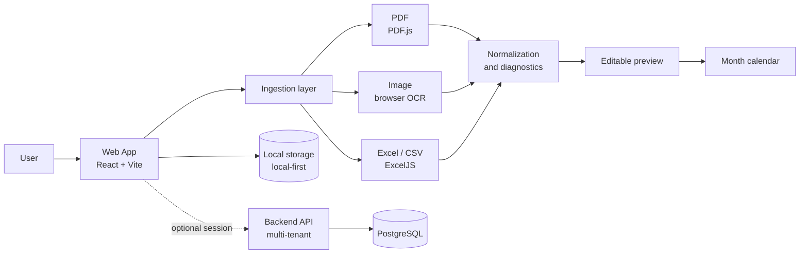
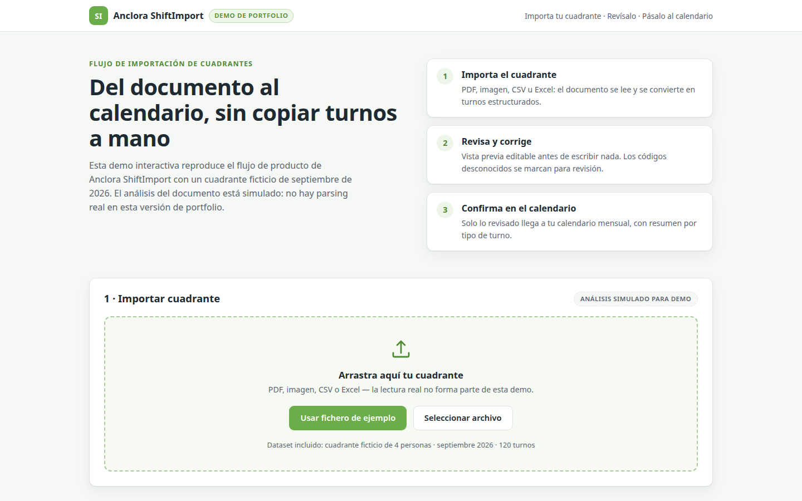
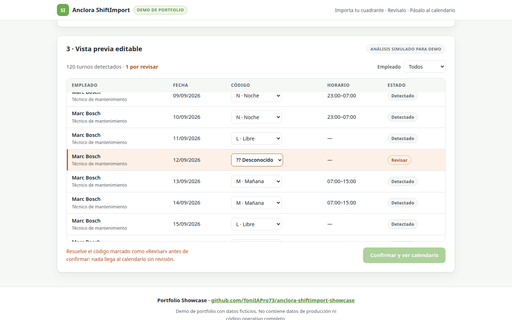
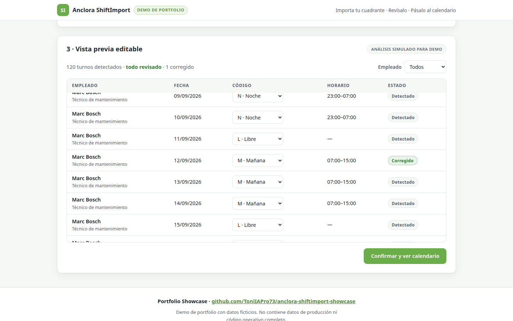
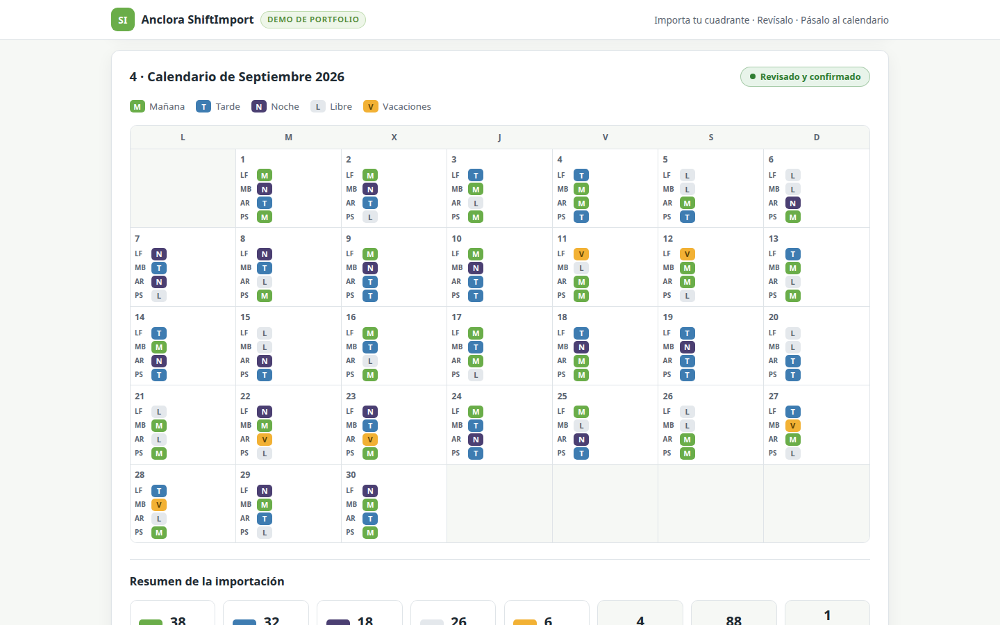

<div align="center">
  

  # Anclora ShiftImport

  **Document-to-calendar workflow for shift workers**

  `React 18` · `Vite 5` · `TypeScript` · `PDF.js` · `OCR (Tesseract.js)` · `Excel (ExcelJS)` · `Local-first`

  [Versión en español → README.md](README.md)
</div>

---

> [!IMPORTANT]
> This repository is a reduced professional showcase.
> It does not contain the operational source code, real worker data,
> real shift rosters, credentials, proprietary parsing logic,
> production configuration, or internal documentation from the original project.

> [!IMPORTANT]
> Este repositorio es una versión reducida para portfolio profesional.
> No contiene el código fuente operativo, datos reales de trabajadores,
> cuadrantes reales, credenciales, lógica propietaria de parsing,
> configuración de producción ni documentación interna del proyecto original.

> [!NOTE]
> All data shown in this repository is fictional and used exclusively for professional portfolio demonstration purposes.
> Todos los datos mostrados en este repositorio son ficticios y se utilizan exclusivamente con fines de demostración profesional.

---

## Live Demo

**[Open live demo → anclora-shiftimport-showcase.vercel.app](https://anclora-shiftimport-showcase.vercel.app)**

To run the interactive demo locally:

```bash
npm install && npm run dev
```

The demo is built with Vite + React + TypeScript on 100% synthetic data; document analysis is simulated (no real parsing). Details in [docs/demo-architecture.md](docs/demo-architecture.md).

## The problem

Shift workers receive their rosters in formats they don't control: company-generated PDFs, spreadsheets, images or CSV files. Getting them into a personal calendar means copying shifts one by one — a slow, error-prone chore that repeats every month.

## The solution

Anclora ShiftImport turns that document into structured shifts. The binding flow is **import → review → calendar**: the app reads the file, extracts and normalizes the information, and presents an **editable preview** where the user reviews, corrects or discards rows before confirming. Nothing is written to the calendar without explicit review.

The technical approach prioritizes reliability and privacy: a deterministic ingestion pipeline with canonical diagnostic states, local-first persistence in the browser in guest mode, and optional per-employee remote sync when signed in.

## At a glance

| Area | What it demonstrates |
|---|---|
| Document ingestion | Reading PDF (PDF.js), images, CSV and Excel (ExcelJS) |
| OCR | Text extraction from images in the browser (Tesseract.js) |
| Data transformation | Converting heterogeneous tables into structured shifts |
| Review workflow | Editable preview: edit/delete rows before confirming |
| Frontend engineering | React + strict TypeScript + Vite, modular components |
| Privacy | Local-first: guest mode with no server; optional remote sync |
| Quality | Unit and component tests (Vitest), E2E (Playwright), CI |

## High-level flow

```text
File (PDF / image / CSV / Excel)
        ↓
Detection and reading
        ↓
Extraction and normalization
        ↓
Editable preview
        ↓
User review
        ↓
Calendar
```

## Architecture



More detail in [docs/architecture.md](docs/architecture.md).

## Screenshots (synthetic data)

| File upload | Editable preview |
|---|---|
|  |  |

| Shift editing | Month calendar |
|---|---|
|  |  |

The screenshots are captured from this repository's interactive demo (`npm run dev`) running on fictional data; they do not come from the operational environment or from real rosters.

## Ingestion capabilities

- **PDF**: positional text extraction with PDF.js.
- **Image (PNG/JPG/WebP)**: in-browser OCR with Tesseract.js; the document never leaves the device.
- **CSV**: automatic delimiter and tabular-structure detection.
- **Excel (xlsx/xls)**: single-employee roster or multi-sheet team roster via ExcelJS.
- **Normalization and validation**: deterministic pipeline with canonical diagnostic states (`READY`, `NEEDS_USER_INPUT`, `PARTIAL`, `BLOCKED`, `UNSUPPORTED`, `FAILED`) — import never fails silently.
- **Assisted review**: unknown shift codes are classified with the user's help, never silently discarded; the user-selected month/year is authoritative.
- **Optional visual fallback**: when the deterministic pipeline cannot read a document, a server-side visual assistant exists — only with an active session and always with results flagged for review.

Conceptual detail in [docs/ingestion-pipeline.md](docs/ingestion-pipeline.md).

## Engineering

- **Strict TypeScript** across the project.
- **Pure, modular ingestion pipeline**, separated from the UI and testable in isolation.
- **Validation before writing**: import never writes directly; editable preview first.
- **User-configurable shift types**, with a neutral default registry and an alias resolver.
- **Internationalization** (es/en) with test-enforced coverage.
- **CI**: strict lint, type-check, build and tests on every push; environment promotion with human approval.
- **Broad test suite** (Vitest + Testing Library) covering ingestion logic, components and API; E2E with Playwright and automatic seed/teardown.

## What this project demonstrates

This project demonstrates hands-on experience in:

- modern frontend engineering (React, TypeScript, Vite);
- document ingestion and processing (PDF, OCR, Excel, CSV);
- transforming semi-structured data into useful information;
- designing review workflows with validation before persistence;
- productivity- and user-control-oriented UX;
- privacy by design (local-first, data minimization);
- product architecture with an optional multi-tenant backend;
- multi-level testing and continuous quality;
- technical documentation and spec-driven development.

## Documentation

- [docs/product-overview.md](docs/product-overview.md) — problem, target user and value proposition
- [docs/architecture.md](docs/architecture.md) — high-level architecture
- [docs/demo-architecture.md](docs/demo-architecture.md) — architecture of this repository's interactive demo
- [docs/ingestion-pipeline.md](docs/ingestion-pipeline.md) — conceptual ingestion pipeline
- [docs/engineering-decisions.md](docs/engineering-decisions.md) — engineering decisions
- [docs/privacy-and-security.md](docs/privacy-and-security.md) — privacy and security
- [docs/testing-and-quality.md](docs/testing-and-quality.md) — testing and quality strategy
- [examples/synthetic/](examples/synthetic/) — fictional sample data

## License

**All Rights Reserved — Portfolio Evaluation Only.**

The materials in this repository are available solely for professional evaluation (recruiting, collaboration, technical due diligence). No permission is granted for reuse, redistribution or commercial use. See [LICENSE](LICENSE).
