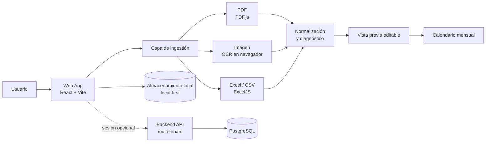
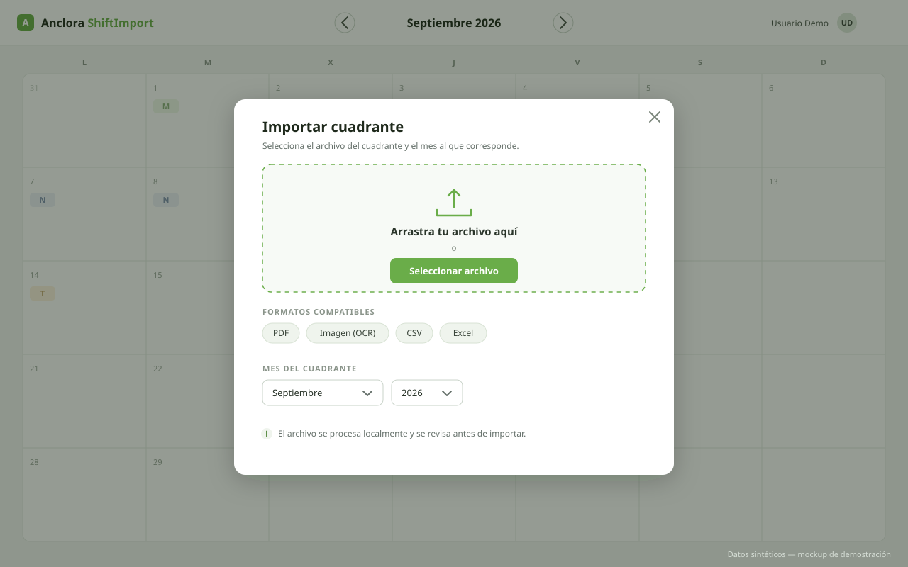
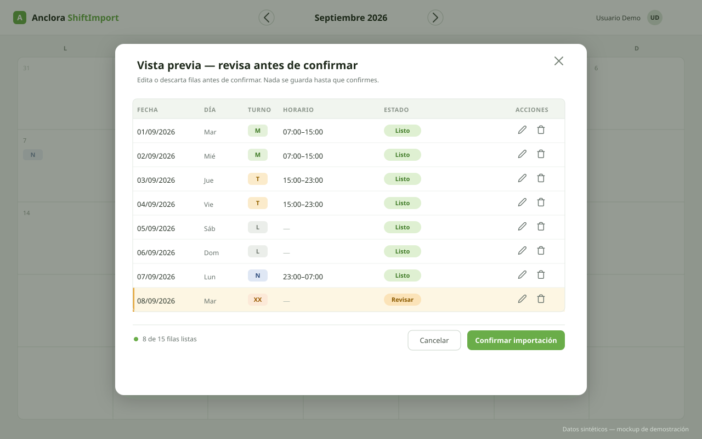
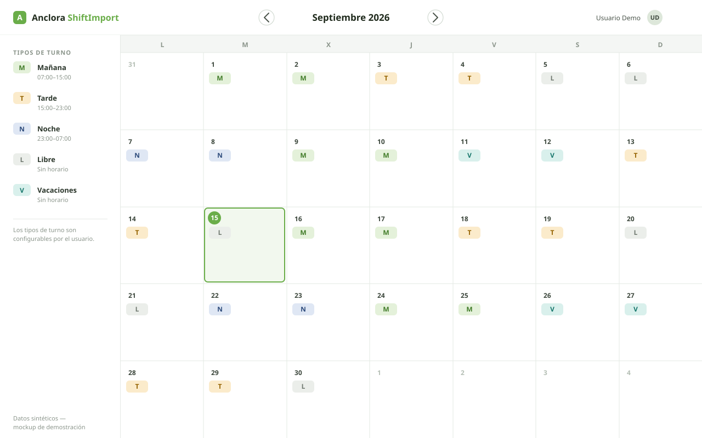
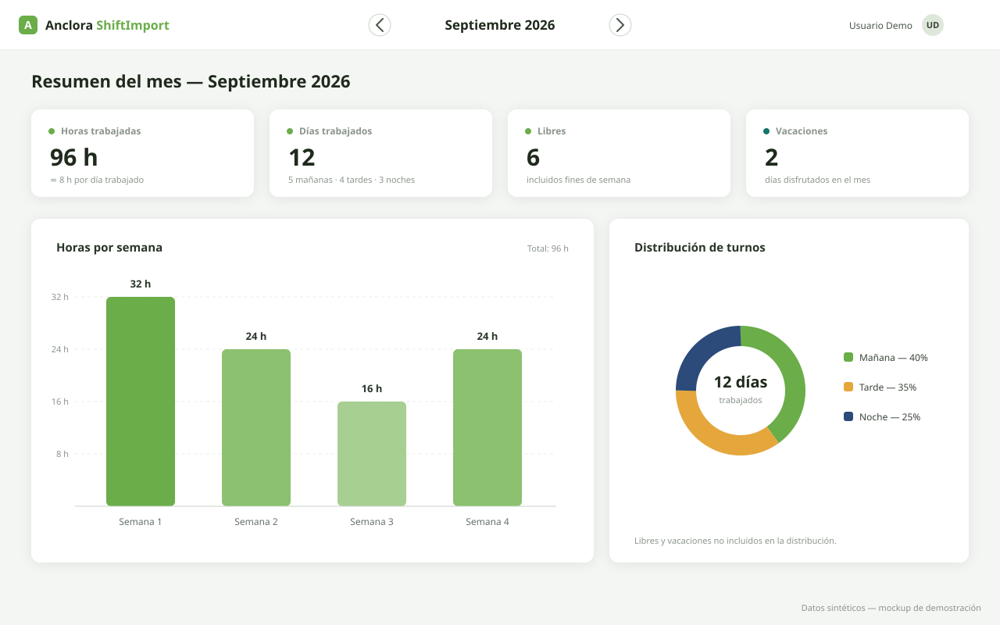

<div align="center">
  

  # Anclora ShiftImport

  **Del documento al calendario: flujo de importación de cuadrantes para personas que trabajan por turnos**

  `React 18` · `Vite 5` · `TypeScript` · `PDF.js` · `OCR (Tesseract.js)` · `Excel (ExcelJS)` · `Local-first`

  [English version → README.en.md](README.en.md)
</div>

---

> [!IMPORTANT]
> Este repositorio es una versión reducida para portfolio profesional.
> No contiene el código fuente operativo, datos reales de trabajadores,
> cuadrantes reales, credenciales, lógica propietaria de parsing,
> configuración de producción ni documentación interna del proyecto original.

> [!IMPORTANT]
> This repository is a reduced professional showcase.
> It does not contain the operational source code, real worker data,
> real shift rosters, credentials, proprietary parsing logic,
> production configuration, or internal documentation from the original project.

> [!NOTE]
> Todos los datos mostrados en este repositorio son ficticios y se utilizan exclusivamente con fines de demostración profesional.
> All data shown in this repository is fictional and used exclusively for professional portfolio demonstration purposes.

---

## El problema

Las personas que trabajan por turnos reciben sus cuadrantes en formatos que no controlan: PDF generados por la empresa, hojas de cálculo, imágenes o CSV. Pasarlos a un calendario personal significa copiar turno a turno a mano — un proceso lento y propenso a errores que se repite cada mes.

## La solución

Anclora ShiftImport convierte ese documento en turnos estructurados. El flujo vinculante es **importar → revisar → calendario**: la aplicación lee el archivo, extrae y normaliza la información, y presenta una **vista previa editable** donde el usuario revisa, corrige o descarta filas antes de confirmar. Nada se escribe en el calendario sin revisión explícita.

El enfoque técnico prioriza fiabilidad y privacidad: pipeline de ingestión determinista con estados de diagnóstico canónicos, persistencia local-first en el navegador en modo invitado, y sincronización remota opcional por empleado cuando hay sesión.

## At a glance

| Área | Qué demuestra |
|---|---|
| Ingestión documental | Lectura de PDF (PDF.js), imágenes, CSV y Excel (ExcelJS) |
| OCR | Extracción de texto desde imagen en el navegador (Tesseract.js) |
| Transformación de datos | Conversión de tablas heterogéneas a turnos estructurados |
| Flujo de revisión | Vista previa editable: editar/eliminar filas antes de confirmar |
| Frontend engineering | React + TypeScript estricto + Vite, componentes modulares |
| Privacidad | Local-first: modo invitado sin servidor; sync remoto opcional |
| Calidad | Tests unitarios y de componentes (Vitest), E2E (Playwright), CI |

## Flujo de alto nivel

```text
Archivo (PDF / imagen / CSV / Excel)
        ↓
Detección y lectura
        ↓
Extracción y normalización
        ↓
Vista previa editable
        ↓
Revisión del usuario
        ↓
Calendario
```

## Arquitectura



Más detalle en [docs/architecture.md](docs/architecture.md).

## Capturas (datos sintéticos)

| Carga de archivo | Vista previa editable |
|---|---|
|  |  |

| Calendario mensual | Métricas |
|---|---|
|  |  |

Las capturas son maquetas recreadas con datos ficticios; no proceden del entorno operativo ni de cuadrantes reales.

## Capacidades de ingestión

- **PDF**: extracción de texto posicional con PDF.js.
- **Imagen (PNG/JPG/WebP)**: OCR en el navegador con Tesseract.js; el documento no sale del dispositivo.
- **CSV**: detección automática de delimitador y de estructura tabular.
- **Excel (xlsx/xls)**: cuadrante individual u hoja de equipo multi-empleado con ExcelJS.
- **Normalización y validación**: pipeline determinista con estados de diagnóstico canónicos (`READY`, `NEEDS_USER_INPUT`, `PARTIAL`, `BLOCKED`, `UNSUPPORTED`, `FAILED`) — la importación nunca falla en silencio.
- **Revisión asistida**: códigos de turno desconocidos se clasifican con ayuda del usuario, nunca se descartan sin avisar; el mes/año elegido por el usuario es autoritativo.
- **Fallback visual opcional**: cuando el pipeline determinista no puede leer el documento, existe un asistente visual server-side, solo con sesión activa y siempre con resultado marcado para revisión.

Detalle conceptual en [docs/ingestion-pipeline.md](docs/ingestion-pipeline.md).

## Ingeniería

- **TypeScript estricto** en todo el proyecto.
- **Pipeline de ingestión puro y modular**, separado de la UI y testeable de forma aislada.
- **Validación antes de escritura**: la importación nunca escribe directamente; preview editable primero.
- **Tipos de turno configurables** por el usuario, con registro neutro por defecto y resolver de alias.
- **Internacionalización** (es/en) con cobertura verificada por tests.
- **CI**: lint estricto, type-check, build y tests en cada push; promoción entre entornos con aprobación humana.
- **Suite de tests amplia** (Vitest + Testing Library) sobre lógica de ingestión, componentes y API; E2E con Playwright y seed/teardown automático.

## Qué capacidades demuestra este proyecto

Este proyecto demuestra experiencia práctica en:

- ingeniería frontend moderna (React, TypeScript, Vite);
- ingestión y procesamiento de documentos (PDF, OCR, Excel, CSV);
- transformación de datos semiestructurados en información útil;
- diseño de workflows de revisión con validación antes de persistir;
- UX orientada a productividad y control del usuario;
- privacidad por diseño (local-first, minimización de datos);
- arquitectura de producto con backend multi-tenant opcional;
- testing en varios niveles y calidad continua;
- documentación técnica y desarrollo guiado por especificaciones.

## Documentación

- [docs/product-overview.md](docs/product-overview.md) — problema, usuario y propuesta de valor
- [docs/architecture.md](docs/architecture.md) — arquitectura de alto nivel
- [docs/ingestion-pipeline.md](docs/ingestion-pipeline.md) — pipeline de ingestión conceptual
- [docs/engineering-decisions.md](docs/engineering-decisions.md) — decisiones de ingeniería
- [docs/privacy-and-security.md](docs/privacy-and-security.md) — privacidad y seguridad
- [docs/testing-and-quality.md](docs/testing-and-quality.md) — estrategia de testing y calidad
- [examples/synthetic/](examples/synthetic/) — datos de ejemplo ficticios

## Licencia

**All Rights Reserved — Portfolio Evaluation Only.**

Los materiales de este repositorio están disponibles únicamente para evaluación profesional (reclutamiento, colaboración, due diligence técnica). No se concede permiso de reutilización, redistribución ni uso comercial. Ver [LICENSE](LICENSE).
