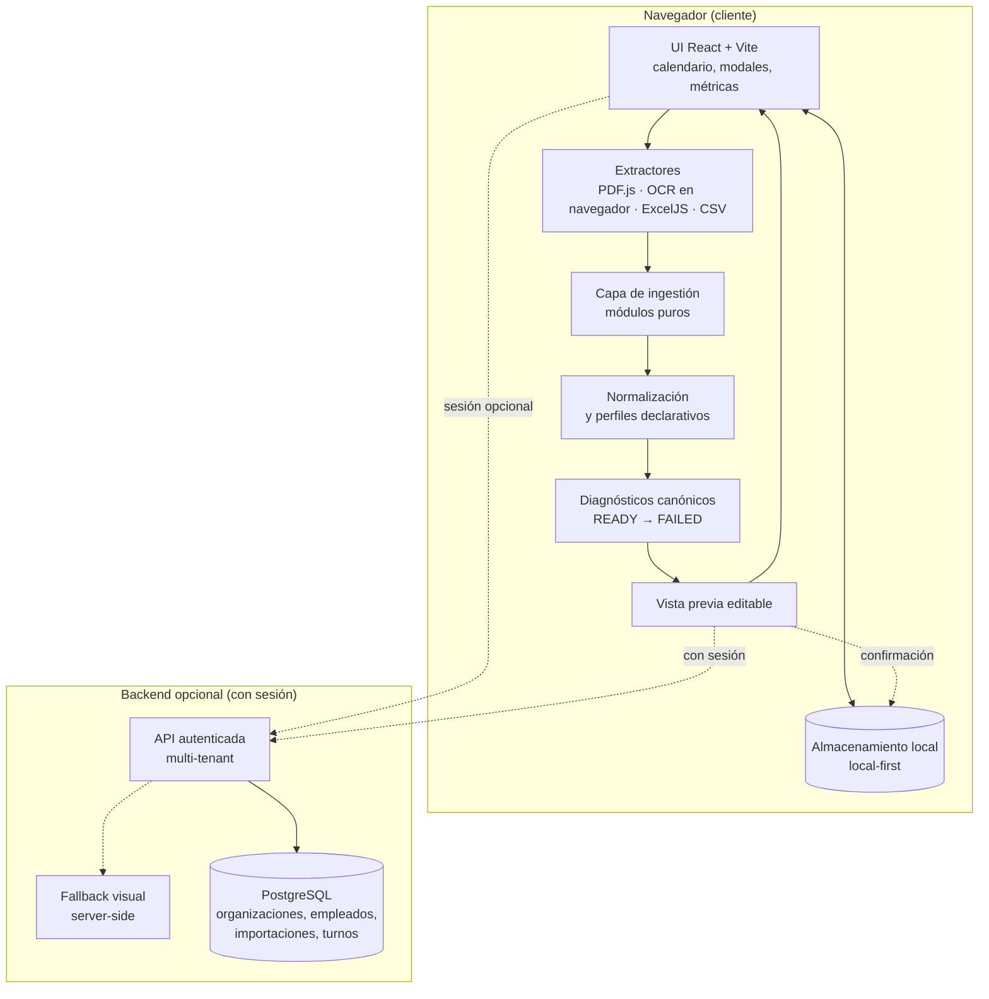

[← Volver al índice](../README.md)

# Arquitectura de alto nivel

Este documento describe la estructura conceptual de Anclora ShiftImport. No incluye detalles operativos, de despliegue ni de configuración: solo las piezas y sus responsabilidades.

## Visión general

La aplicación es una **web app React + Vite** con una arquitectura en capas claramente separadas:

1. **Capa de presentación (UI)**: componentes React, vistas de calendario, modales de flujo.
2. **Capa de ingestión**: módulo puro y testeable, aislado de la UI, que convierte documentos en turnos.
3. **Capa de normalización y diagnóstico**: modelo canónico de estados y errores estructurados.
4. **Capa de persistencia local**: local-first en el navegador (modo invitado).
5. **Backend opcional**: API autenticada multi-tenant sobre PostgreSQL para sincronización remota.

La pieza central es la **capa de ingestión**: no conoce React, ni el DOM, ni el almacenamiento. Recibe contenido extraído y devuelve resultados estructurados. Eso permite probarla de forma aislada y razonar sobre ella sin arrancar la aplicación.

## Diagrama

## Responsabilidades por capa

### UI (React + TypeScript + Vite)

- Calendario mensual y semanal, métricas, selector de empleado.
- Modales de flujo: importación, edición de turno, perfiles de formato, onboarding.
- La UI **consume diagnósticos estructurados**, nunca excepciones crudas.
- Sin lógica de negocio de parsing: la UI orquesta, no interpreta documentos.

### Capa de ingestión

- Conjunto de **módulos puros** (sin efectos laterales): extracción, normalización, detección de estructura, construcción de turnos, análisis de calidad.
- Cada formato tiene su extractor (PDF, imagen, CSV, Excel), pero todos convergen en una representación intermedia común sobre la que trabaja el resto del pipeline.
- Testeable de forma aislada: la mayor parte de la suite unitaria cubre esta capa (ver [testing-and-quality.md](testing-and-quality.md)).
- Detalle conceptual en [ingestion-pipeline.md](ingestion-pipeline.md).

### Normalización y diagnóstico

- Todo resultado de importación se expresa con un **estado canónico** (`READY`, `NEEDS_USER_INPUT`, `PARTIAL`, `BLOCKED`, `UNSUPPORTED`, `FAILED`) más diagnósticos estructurados orientados a recuperación guiada.
- Regla de producto: la importación **nunca falla en silencio**; la UI siempre tiene un estado que mostrar y una acción que ofrecer.

### Vista previa editable

- Frontera entre lectura y escritura: la importación nunca persiste directamente.
- El usuario puede editar o eliminar filas antes de confirmar; la confirmación es el único punto de escritura.

### Persistencia local-first

- En modo invitado, todo vive en el navegador: turnos, preferencias, tipos de turno configurados.
- La app es plenamente funcional sin cuenta, sin servidor y sin conexión.
- Detalle en [privacy-and-security.md](privacy-and-security.md).

### Backend opcional (multi-tenant)

- Funciones serverless autenticadas con sesión por cookie, delante de una base de datos PostgreSQL.
- Modelo multi-tenant: **Organization**, **Membership** (roles ADMIN/MANAGER/EMPLOYEE), **Employee**, **Import** y **Shift**; todo dato queda acotado a su organización y el aislamiento lo fuerza el servidor, nunca el cliente.
- Esquema versionado con migraciones sucesivas.
- La sincronización es **opt-in**: con sesión, la persistencia remota es por empleado, y existe una migración one-shot local → remoto que conserva la copia local.
- **Fallback visual server-side**: cuando el pipeline determinista no puede leer un documento, un asistente visual remoto puede intentarlo — solo con sesión activa, con el resultado siempre marcado para revisión, y con fallos tratados como diagnósticos no bloqueantes.

## Decisiones estructurales clave

- **Ingestión separada de la UI**: la parte más frágil del sistema queda aislada, pura y exhaustivamente testeada.
- **Validación antes de escritura**: ningún camino del código persiste turnos sin pasar por la confirmación del usuario.
- **Local-first como valor por defecto**: el backend es una capacidad añadida, no una dependencia.
- **Aislamiento en el servidor**: la pertenencia a organización se valida siempre en backend; el cliente nunca decide a qué datos accede.

Las motivaciones de cada elección tecnológica están en [engineering-decisions.md](engineering-decisions.md). La demo interactiva ejecutable de este repositorio se describe en [demo-architecture.md](demo-architecture.md).
